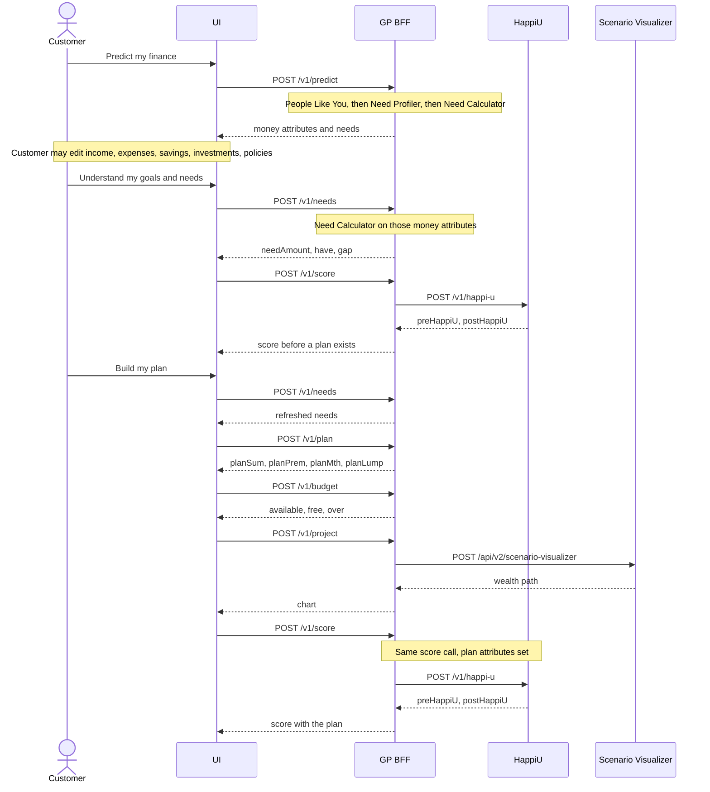

# 360-Goal Planner — architecture

## Role in the suite

```text
Customer (React UI)
        │
        ▼
GP BFF  (FastAPI)
        ├── POST /v1/parse-sentence  → OpenAI (About You fields)
        ├── POST /v1/explain         → OpenAI + src/prompts/*.md
        ├── POST /v1/predict         → FX lock → social security → People Like You
        │                            → Need Profiler → Need Calculator
        │                            (in-process; 503 if People Like You cannot run)
        ├── POST /v1/needs           → Need Calculator (same evaluate_session)
        ├── POST /v1/plan            → suggested plan (was frontend maths)
        ├── POST /v1/budget          → affordability vs the included plan
        ├── POST /v1/score           → HU POST /v1/happi-u
        └── POST /v1/project         → SV POST /api/v2/scenario-visualizer
```

GP is a **customer UI + BFF**. People Like You / Need Profiler / Need Calculator
run in-process. HappiU and the chart stay in HU / SV. Mapping to those engines
lives in `hu_payload.py` / `sv_payload.py` — what each field becomes is in
[HU-and-SV-payloads.md](HU-and-SV-payloads.md). Prompts instruct the model to use
only the JSON context the UI already displayed.

## Stack

- **Backend:** FastAPI + uvicorn, Python 3.13, `openai`, `requests` / `httpx`.
- **Frontend:** React 19, Vite 8 (`:5179`), Tailwind 4. Plotly for the plan chart.
- **Compose:** `deployment/docker/GP.Dockerfile` bakes `frontend/dist` and
  serves it from the API process when that folder exists.

## Modules

| Path | Role |
|------|------|
| [`src/app.py`](../src/app.py) | FastAPI factory, CORS, routes, static UI mount |
| [`src/predict.py`](../src/predict.py) | Session mapping; FX lock and service clients |
| [`src/upstream.py`](../src/upstream.py) | FM / HU / SV HTTP helpers and timeouts |
| [`src/openai_client.py`](../src/openai_client.py) | Shared OpenAI chat helper |
| [`src/hu_payload.py`](../src/hu_payload.py) | Session → HappiU `POST /v1/happi-u` body ([payload map](HU-and-SV-payloads.md)) |
| [`src/sv_payload.py`](../src/sv_payload.py) | Session → SV scenario-visualizer body ([payload map](HU-and-SV-payloads.md)) |
| [`src/parse_sentence.py`](../src/parse_sentence.py) | OpenAI extract of About You fields |
| [`src/explain.py`](../src/explain.py) | Load prompts, call OpenAI, deterministic fallback |
| [`src/prompts/*.md`](../src/prompts/) | Mira / page explainer prompts |
| [`frontend/src/`](../frontend/src/) | Shell, five pages, session state, speech |
| [`run_server.py`](../run_server.py) | uvicorn entry (`src.app:api`) |

## Request lifecycle

### Journey sequence

Which button calls which component. What each component reads and writes is in
[calculations/Calculations.md](calculations/Calculations.md). People Like You, Need Profiler,
Need Calculator, Plan and Budget run inside the BFF. HappiU and Scenario Visualizer
are upstream.



**Understand my goals and needs** is the step that runs Need Calculator and
then HappiU. While the customer is still on Your money, an edit of those
figures can also call `POST /v1/needs` after a short delay. That call updates
the stored amounts and stays on the page.

`POST /v1/plan` seeds sums, premiums and contributions. `POST /v1/budget`
compares half the surplus to that included plan. Neither call changes the
session sent to Scenario Visualizer or to the second HappiU call.

### Predict (`POST /v1/predict`)

1. Normalize session (synthesize `dateOfBirth` from age if missing).
2. Lock FX (`FxLock` on the session) unless the client already sent one.
3. Run **People Like You** in-process (service, not the old occupation-band fallback).
4. On People Like You failure, return **503**.
5. Need Profiler (11 Dictionary labels; N_PRP / N_LTC never auto-picked) then
   Need Calculator (`evaluate_session`), also in-process.
6. Return `{ success, session, notes }` including `parkedNeeds` and `fx`.
   Notes list which steps were skipped.

Goal-card and money edits call **`POST /v1/needs`**, the same calculator.
How People Like You, Need Profiler, and Need Calculator work is in
[People-like-you-and-needs.md](People-like-you-and-needs.md). Suggested plan
and budget stay in [calculations/Calculations.md](calculations/Calculations.md).

### Score / project

`build_happiu_payload` / `build_sv_payload` turn the same session into engine
JSON. Field-by-field map: [HU-and-SV-payloads.md](HU-and-SV-payloads.md).
HU/SV errors surface as **503** (unreachable) or the upstream status.
SV is called with `tenant_id=helium`.

### Explain (`POST /v1/explain`)

1. Validate `kind` ∈ `{mira, intro, money, score, chart, prod}`.
2. Mira also needs `route` ∈ `{d2cIntro, d2cAbout, d2cMoney, d2cScore, d2cPlan}`.
3. Load `voice.md` + the kind/route task file (Mira on money/score also
   concatenates `money.md` / `score.md`).
4. If `OPENAI_API_KEY` is set, chat completion (`temperature=0.4`); on failure
   or short output, use `fallback_script`.
5. Return `{ text, source: "llm" | "fallback" }`.

The UI builds a compact **context** object (figures, gaps, chart endpoints) in
[`frontend/src/lib/explain.ts`](../frontend/src/lib/explain.ts) so the model
never sees full SV year arrays.

## Prompts

Plain Markdown under `src/prompts/`. Edit them to change spoken tone without
changing Python.

| File | Trigger |
|------|---------|
| `voice.md` | Prepended to every explainer |
| `mira_intro.md` … `mira_plan.md` | Mira FAB on that screen |
| `intro.md` | Start — “Hear what you get” |
| `money.md` | “Explain these figures” |
| `score.md` | “Explain this page” |
| `chart.md` | “Explain this chart” |
| `products.md` | “Why these products” |

## Frontend

Single-page app (`App.tsx`) holds the session and route. `Shell` is the chrome
(progress nav, Mira + human-adviser FABs). Pages: `Intro`, `AboutYou`, `Money`,
`Score`, `Plan`. Speech: Web Speech API (`lib/speech.ts`). Optional portal JWT
hash (`#siriheritage_auth=`) via `lib/auth.ts`.

When `frontend/dist` exists, FastAPI mounts it at `/` **after** the API routes,
so `/v1/*` still hits the BFF.

## Auth

No login required. If the portal hands off a JWT, `predict` can persist
onboarding to FM (`/v1/me/onboarding/...`). Public FM paths are used otherwise.
