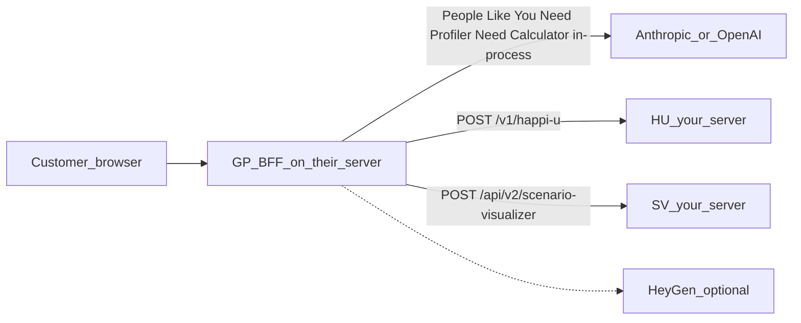

# GP as a third-party app talking to your APIs

This repository **is** that GP-only clone (`360-goal-planner`). Day-to-day
edits still live in `happiU_SV_portfolio` (`GP/`); refresh this repo with
`python deployment/push_gp_standalone.py` from the workspace.


How to give a third party **GP source only** (their own GitHub repo) while their
running app still talks to **your** FM / HU / SV over HTTP.

## Short answers

**A new branch in `happiU_SV_portfolio` is not enough.** GP lives in the
workspace git tree, not its own repo. Anyone invited to that GitHub repo sees
HU, SV, FM, PA, PG, portal, and secrets-shaped docs — not just `GP/`.
Documented as open item [#10 in Open-issues-and-tasks.md](Open-issues-and-tasks.md).

**GP can still run on their server** if their BFF can reach your HU / SV (and
has an Anthropic or OpenAI key for People Like You). The React UI only talks
to GP (`/v1/*`). Estimate no longer needs FM. PA and PG are not used.



## Git: what to share

| Approach | Third party sees only GP? | GP still works? |
|----------|---------------------------|-----------------|
| New branch on this repo | No | Yes, but they get the whole workspace |
| `python deployment/push_gp_standalone.py` | Yes | Yes |

Recommended: **new private GitHub repo** (`360-goal-planner`), not a
branch of `michaelGoogle/happiU_SV_portfolio`. Keep this workspace on
`working`. Refresh the standalone repo only when you run:

```powershell
python deployment/push_gp_standalone.py
```

That copies `GP/` into `D:\360-goal-planner` (or `GP_STANDALONE_DIR`), applies
standalone packaging, and pushes `main` to `michaelGoogle/360-goal-planner`.
If this workspace is dirty, the script commits on `working` first (stash leftovers).
Dirty files in the standalone checkout are stashed unless you pass `--force`.
Ordinary commits in this workspace stay on `happiU_SV_portfolio` / `working`.

**Packaging so their clone builds:**

- Copy or vendor [`shared/input_model`](../../shared/input_model) **or** drop
  the unused `@siriheritage/input-model` npm dep.
  [`frontend/package.json`](../frontend/package.json) and
  [`GP.Dockerfile`](../../deployment/docker/GP.Dockerfile) require it at
  install/build time even though `frontend/src` does not import it.
- Put a Dockerfile **inside** the GP repo (today it lives at
  [`deployment/docker/GP.Dockerfile`](../../deployment/docker/GP.Dockerfile)
  with **workspace-root** build context).
- Give them a `.env.example` with `FM_UPSTREAM` / `HU_UPSTREAM` /
  `SV_UPSTREAM` pointing at **your WAN URLs**, not `http://fm:8062`.
- [`src/env_bootstrap.py`](../src/env_bootstrap.py) currently loads `GP/.env`
  then **parent** `../.env`. On a standalone clone, parent `.env` will not
  exist — that is fine if they set env on the process.

Do **not** put Anthropic / OpenAI / HeyGen / SMTP passwords in the shared
repo. They use their own keys, or you issue them separately.

## APIs you must open (current running code)

[`src/app.py`](../src/app.py) `/v1/predict` runs People Like You, Need Profiler,
and Need Calculator **in-process** (`src/pipeline/`). They need
`ANTHROPIC_API_KEY` (or `OPENAI_API_KEY`) on their GP process. FM is not
required for Estimate.

### Required for a full D2C journey

| Their GP route | Calls | Method + path | Env on their GP | Typical URL today |
|----------------|-------|---------------|-----------------|-------------------|
| `POST /v1/predict` (Estimate) | **In-process** + LLM | — | `ANTHROPIC_API_KEY` | — |
| `POST /v1/score` | **HU** | `POST /v1/happi-u` | `HU_UPSTREAM` | LAN `:8063` · WAN `:8463` |
| `POST /v1/project` | **SV** | `POST /api/v2/scenario-visualizer?tenant_id=helium` | `SV_UPSTREAM` | LAN `:8064` · WAN `:8464` |

Timeout: `GP_UPSTREAM_TIMEOUT_S` (default 90s). Increase if WAN latency is
high. HU/SV errors become **503** in GP.

**Auth today: none.** HU and SV have no API key. FM’s `/v1/public/*` paths are
unauthenticated compute. Opening these to the whole internet means anyone who
finds the URL can score/project. Prefer **IP allowlist** (their GP server only)
on Synology reverse proxy / firewall for 8462 / 8463 / 8464. Do not rely on
CORS (GP uses server-side `requests`, not the browser).

**PII:** income, DOB, occupation, dependents, assets travel in JSON from their
GP to your FM/HU/SV. Use HTTPS (WAN 846x already).

### LLM (not your servers — they need keys)

| Used by | Env | If missing |
|---------|-----|------------|
| About You sentence + spoken explainers (GP itself) | `ANTHROPIC_API_KEY` (preferred) or `OPENAI_API_KEY` | parse `unavailable`; explainers fall back to canned scripts |
| People Like You (runs **on FM** today) | Same keys on **your FM** process | Estimate **503** |

They do not need your FM/HU/SV source. They do need outbound HTTPS to
`api.anthropic.com` / OpenAI if they run parse/explain on their GP. You still
need the LLM key on **FM** for Estimate until predict is in-process.

### Optional (plan-report video)

| Service | Path / protocol | Env |
|---------|-----------------|-----|
| HeyGen | `POST https://api.heygen.com/v3/video-agents` Video Agent, poll `GET /v3/video-agents/{session_id}` then `GET /v3/videos/{id}` | `HEYGEN_API_KEY`, optional `HEYGEN_AVATAR_ID` / `HEYGEN_VOICE_ID` |
| Media host | public MP4 URL | `MEDIA_DIR`, `MEDIA_PUBLIC_BASE_URL` (WAN `:8442/videos`) |
| SMTP | their or yours | `SMTP_*` |
| WhatsApp gateway | `POST {WHATSAPP_GATEWAY_URL}/send` | `WHATSAPP_GATEWAY_URL` (compose `wa:8091`) |

Skip these unless they need “send me the video”. See
[Report-video.md](Report-video.md).

### Not required

- **PA**, **PG**, portal, FM login/onboarding persist, fund registry / SQLite.
- Browser access to HU/SV/FM. Only **their GP server** needs inbound-to-you.

## Firewall / reverse-proxy checklist (your side)

1. Keep WAN reverse proxy: **8462 → FM:8062**, **8463 → HU:8063**,
   **8464 → SV:8064**.
2. Restrict 8462/8463/8464 to the third party’s **GP server IP** (not
   `0.0.0.0/0`).
3. Confirm `POST` JSON (not only GET `/health`) works through the proxy;
   HU/SV bodies are large.
4. Give them:

```text
HU_UPSTREAM=https://mgzh11.synology.me:8463
SV_UPSTREAM=https://mgzh11.synology.me:8464
GP_UPSTREAM_TIMEOUT_S=120
ANTHROPIC_API_KEY=their-or-yours
```

5. Smoke from *their* host: `POST /v1/happi-u`,
   `POST /api/v2/scenario-visualizer?tenant_id=helium`. Then start GP with those
   env vars. Estimate uses the Anthropic key on GP, not FM.

## What “working” means on their server

- **About You** works with no engines (local regex if no LLM).
- **Estimate** needs an LLM key on GP (`ANTHROPIC_API_KEY` or `OPENAI_API_KEY`).
- **Your score** needs HU.
- **Your plan** needs SV (`tenant_id=helium` hardcoded in
  [`sv_project`](../src/upstream.py)).
- **Video notify** needs HeyGen (+ media/SMTP/WhatsApp as above).

They run: Python 3.13 BFF (`python run_server.py`, port 8009) + Vite 5179, or
Docker with a GP-local Dockerfile serving baked `frontend/dist` on one port.
