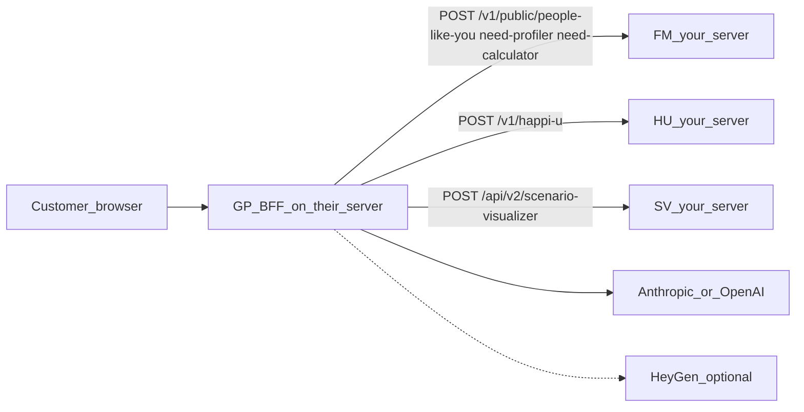

# GP as a third-party app talking to your APIs

How to give a third party **GP source only** (their own GitHub repo) while their
running app still talks to **your** FM / HU / SV over HTTP.

## Short answers

**A new branch in `happiU_SV_portfolio` is not enough.** GP lives in the
workspace git tree, not its own repo. Anyone invited to that GitHub repo sees
HU, SV, FM, PA, PG, portal, and secrets-shaped docs — not just `GP/`.
Documented as open item [#10 in Open-issues-and-tasks.md](Open-issues-and-tasks.md).

**GP can still run on their server** if their BFF can reach your engines. The
React UI only talks to GP (`/v1/*`). GP then calls FM / HU / SV. PA and PG are
not used.



## Git: what to share

This repository **is** the GP-only GitHub remote. Invite collaborators here, not
to `michaelGoogle/happiU_SV_portfolio`.

Clone, copy `.env.example` to `.env`, set upstream URLs, then `python run_server.py`
or `docker compose up -d --build`.

**Packaging already applied in this repo:**

- Unused `@siriheritage/input-model` npm dep removed (frontend did not import it).
- [`Dockerfile`](../Dockerfile) and [`docker-compose.yml`](../docker-compose.yml)
  live at the repo root (build context = this tree).
- [`.env.example`](../.env.example) has WAN `FM_UPSTREAM` / `HU_UPSTREAM` /
  `SV_UPSTREAM`.
- [`src/env_bootstrap.py`](../src/env_bootstrap.py) loads this repo’s `.env`,
  then a parent `.env` if present. A standalone clone only needs `.env` here.

Do **not** put Anthropic / OpenAI / HeyGen / SMTP passwords in the shared
repo. They use their own keys, or you issue them separately.

## APIs you must open (current running code)

[`src/app.py`](../src/app.py) `/v1/predict` calls FM over HTTP (`_safe_fm` →
[`fm_public`](../src/upstream.py)).

### Required for a full D2C journey

| Their GP route | Calls your service | Method + path | Env on their GP | Typical URL today |
|----------------|--------------------|---------------|-----------------|-------------------|
| `POST /v1/predict` (Estimate) | **FM** | `POST /v1/public/people-like-you` then `/v1/public/need-profiler` then `/v1/public/need-calculator` | `FM_UPSTREAM` | LAN `http://192.168.1.43:8062` · WAN `https://mgzh11.synology.me:8462` |
| `POST /v1/score` | **HU** | `POST /v1/happi-u` | `HU_UPSTREAM` | LAN `:8063` · WAN `:8463` |
| `POST /v1/project` | **SV** | `POST /api/v2/scenario-visualizer?tenant_id=helium` | `SV_UPSTREAM` | LAN `:8064` · WAN `:8464` |

Timeout: `GP_UPSTREAM_TIMEOUT_S` (default 90s). Increase if WAN latency is
high. HU/SV errors become **503** in GP.

**Auth today: none.** HU and SV have no API key. FM’s `/v1/public/*` paths are
unauthenticated compute. Opening these to the whole internet means anyone who
finds the URL can score/project. Prefer **IP allowlist** (their GP server only)
on Synology reverse proxy / firewall for 8462 / 8463 / 8464. Do not rely on
CORS (GP uses server-side `requests`, not the browser).

**PII:** income, DOB, occupation, dependents, assets travel in JSON from their
GP to your FM/HU/SV. Use HTTPS (WAN 846x already).

### LLM (not your servers — they need keys)

| Used by | Env | If missing |
|---------|-----|------------|
| About You sentence + spoken explainers (GP itself) | `ANTHROPIC_API_KEY` (preferred) or `OPENAI_API_KEY` | parse `unavailable`; explainers fall back to canned scripts |
| People Like You (runs **on FM** today) | Same keys on **your FM** process | Estimate **503** |

They do not need your FM/HU/SV source. They do need outbound HTTPS to
`api.anthropic.com` / OpenAI if they run parse/explain on their GP. You still
need the LLM key on **FM** for Estimate until predict is in-process.

### Optional (plan-report video)

| Service | Path / protocol | Env |
|---------|-----------------|-----|
| HeyGen | `POST https://api.heygen.com/v3/videos` Avatar III talking-head, poll `GET /v3/videos/{id}` | `HEYGEN_API_KEY`, optional `HEYGEN_AVATAR_ID` / `HEYGEN_VOICE_ID` |
| Media host | public MP4 URL | `MEDIA_DIR`, `MEDIA_PUBLIC_BASE_URL` (WAN `:8442/videos`) |
| SMTP | their or yours | `SMTP_*` |
| WhatsApp gateway | `POST {WHATSAPP_GATEWAY_URL}/send` | `WHATSAPP_GATEWAY_URL` (compose `wa:8091`) |

Skip these unless they need “send me the video”. See
[Report-video.md](Report-video.md).

### Not required

- **PA**, **PG**, portal, FM login/onboarding persist, fund registry / SQLite.
- Browser access to HU/SV/FM. Only **their GP server** needs inbound-to-you.

## Firewall / reverse-proxy checklist (your side)

1. Keep WAN reverse proxy: **8462 → FM:8062**, **8463 → HU:8063**,
   **8464 → SV:8064**.
2. Restrict 8462/8463/8464 to the third party’s **GP server IP** (not
   `0.0.0.0/0`).
3. Confirm `POST` JSON (not only GET `/health`) works through the proxy;
   HU/SV bodies are large.
4. Give them:

```text
FM_UPSTREAM=https://mgzh11.synology.me:8462
HU_UPSTREAM=https://mgzh11.synology.me:8463
SV_UPSTREAM=https://mgzh11.synology.me:8464
GP_UPSTREAM_TIMEOUT_S=120
```

5. Smoke from *their* host: `POST /v1/happi-u`,
   `POST /api/v2/scenario-visualizer?tenant_id=helium`,
   `POST /v1/public/people-like-you` (minimal bodies). Then start GP with those
   env vars.

## Optional: drop FM from the third-party path

If `/v1/predict` is later moved in-process (People Like You / profiler /
calculator inside GP), you **only open HU + SV**, and they hold the Anthropic
key on GP. That is the better split: FM stays private (accounts, funds,
statements).

## What “working” means on their server

- **About You** works with no engines (local regex if no LLM).
- **Estimate** needs FM (today) + LLM on FM.
- **Your score** needs HU.
- **Your plan** needs SV (`tenant_id=helium` hardcoded in
  [`sv_project`](../src/upstream.py)).
- **Video notify** needs HeyGen (+ media/SMTP/WhatsApp as above).

They run: Python 3.13 BFF (`python run_server.py`, port 8009) + Vite 5179, or
Docker with a GP-local Dockerfile serving baked `frontend/dist` on one port.
